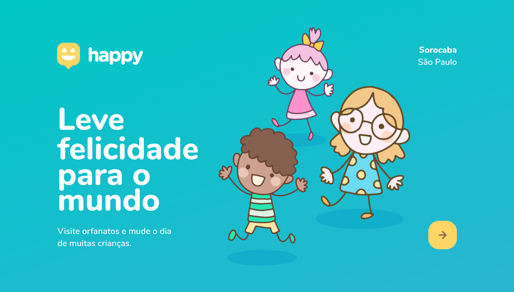

# Happy - Next Level Week 03

## Projeto 🗃

Esta aplicação tem como objetivo de ajudar as crianças de orfanatos a encontrar uma pessoa de bom coração
para fazer uma visita e dar amor a todas crianças.

## Tecnologias 🦾

- [Node](https://nodejs.org/en/)
- [ReactJS](https://pt-br.reactjs.org/)
- [React Native](https://reactnative.dev/)
- [Expo](https://expo.io/)
- [Typescript](https://www.typescriptlang.org/)
- [TypeORM](https://typeorm.io/#/)

## Contribuição 🔧

- Faça um fork do repositorio.
- Cria um Branch com sua feature : `git checkout -b minha-feature`
- Faça commit das suas alterações : `git commit -m 'feat: Minha nova feature`
- Faça push para a sua branch: `git push origin minha-feature`

## Licença 📝

Esse projeto está so a licença MIT. Veja o arquivo [LICENSE](https://raw.githubusercontent.com/DenisMedeirosSDK/Rocketseat-events/master/LICENSE) para mais detalhes.
