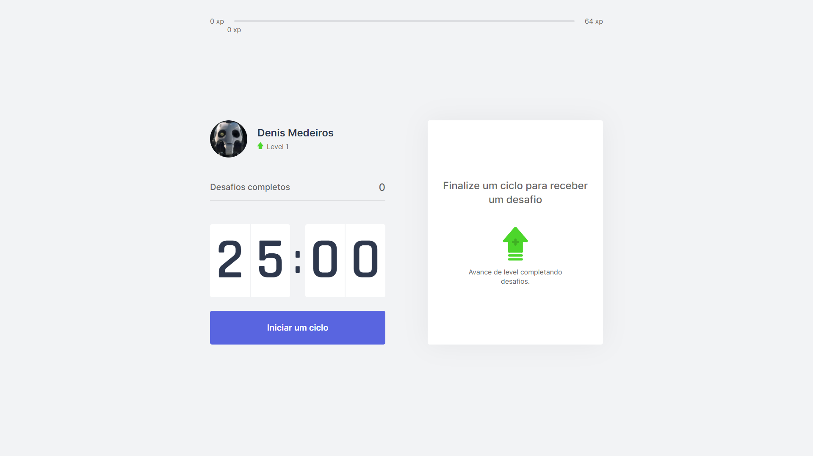

# 👊 Move.it



## Projeto

Essa aplicação foi desenvolvida com [Next.js](https://nextjs.org/), no projeto desenvolvemos uma especie de pomodoro com leveis de experiencia. A cada 25:00 minutos completados é liberado um desafio onde o usuário pode ou não cumprir, ao cumprir o desafio ele ganha XP para passar de level na aplicação.

## Como executar o projeto

Primeiro, executando em desenvolvimento:

```bash
npm run dev
# or
yarn dev
```

Abra [http://localhost:3000](http://localhost:3000) com seu navegador para ver o resultado.
