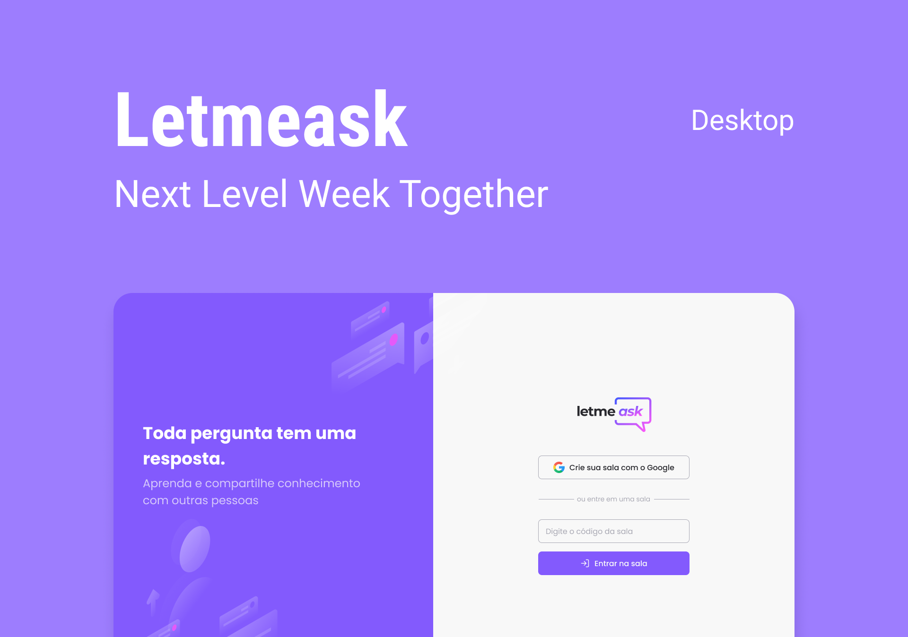

# 💼 Letmeask - NLW 06



## 📝 Projeto

Crie uma sala e compartilhe com as pessoas para que possam fazer perguntas sobre o tema.

## 🛠 Tecnologia

1. Typescript
2. React
3. Firebase
4. SASS
5. CRA (Create React App)

---

## Firebase Resources:

- Authentication: Google

- Database: Realtime database

```JSON
//Regras database realtime

{
  "rules": {
    "rooms": {
      ".read": false,
    	".write": "auth != null",
      "$roomId": {
        ".read": true,
        ".write": "auth != null && (!data.exists() || data.child('authorId').val() === auth.id)",
        "questions": {
          ".read": true,
          ".write": "auth != null && (!data.exists() || data.parent().child('authorId').val() == auth.id)",
          "likes": {
            ".read": true,
        		".write": "auth != null && (!data.exists() || data.child('authorId').val() === auth.id)"
          }
        }
      }
    }
  }
}
```

---

# Executar o projeto

Faça o clone do repositório

```bash
git clone https://github.com/DenisMedeirosSDK/Rocketseat-events.git
```

Entre no diretório NLW_Booster_06/react

```bash
cd Rocketseat-events/NLW_Booster_06/react
```

Instale as dependência com `npm run install` ou `yarn`

Execute `npm run start` ou `yarn start`

Acesse `http://localhost:3333/`

**Rotas disponíveis**

- /
- /rooms/new
- /rooms/:id
- /admin/rooms/:id
