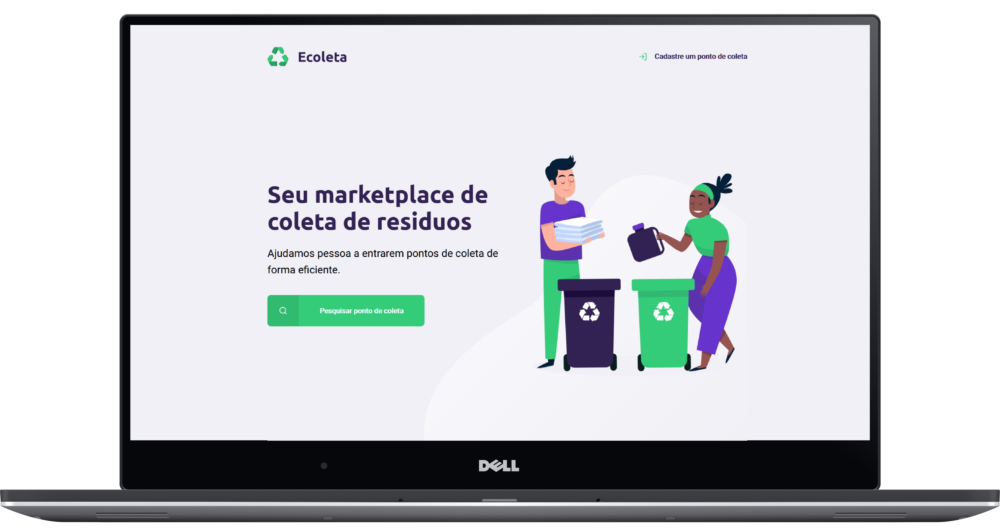

# Ecoleta - Aplicação Full MVC 🧠 🖥



## Tecnologias usadas para construção ⛏

- [Node](https://nodejs.org/en/)
- [Express](https://expressjs.com/pt-br/)
- [Nunjucks](https://mozilla.github.io/nunjucks/)
- [Javascript](https://www.javascript.com/)
- [HTML](https://developer.mozilla.org/pt-BR/docs/Web/HTML)
- [CSS](https://developer.mozilla.org/pt-BR/docs/Web/CSS)
- [SQLite3](https://www.sqlite.org/index.html)

## Procedimento para execução 🛠

Execute os seguintes comandos:

`npm install` para instalar todas as dependencias.

`node src/database/db.js` para criar o banco de dados.

`npm start` para executar o servidor;

## Debug

### Rotas disponiveis

- _http://localhost:3000/_

- _http://localhost:3000/search_

- _http://localhost:3000/createpoint_

- _http://localhost:3000/savepoint_ -> apenas com o envio do formulario no frontend.

Caso sua porta **3000** esteja sendo usado mude no arquivo `src/server.js`

```js
server.listen(3000);
```

Caso queira inserir/deletar ou selecionar um dado no banco de dados via backend basta ir no arquivo `src/database/example-db.js` copiar o exemplo que queira e colar no arquivo `src/database/db.js` subistituindo o outro comando existente depois execute o comando `node src/database`

## Licença 📝

Esse projeto está so a licença MIT. Veja o arquivo [LICENSE](https://raw.githubusercontent.com/DenisMedeirosSDK/Rocketseat-events/master/LICENSE) para mais detalhes.
