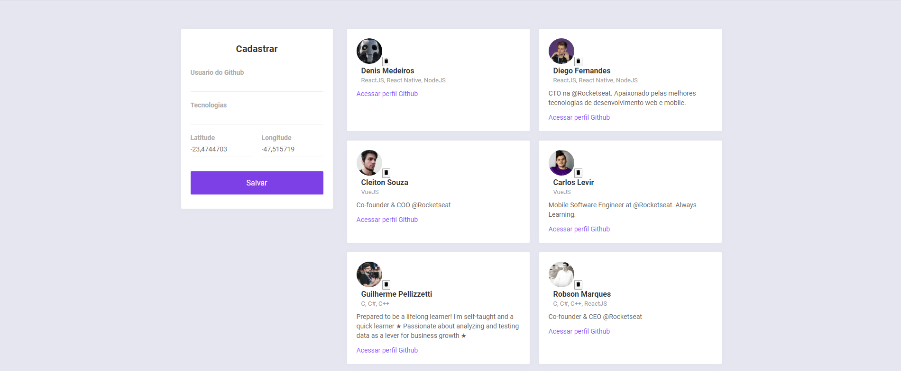

# OmniStack_10

Aplicação desenvolvida na primeira semana OmniStack de 2020.

## 🤯 Oque eu aprendi

- Implementação de no mobile mapa.
- Localização do usuario.

## 🔧 Como contribuir

- Faça um fork do repositorio
- Cria um Branch com sua feature : `git checkout -b minha-feature`
- Faça commit das suas alterações : `git commit -m 'feat: Minha nova feature`
- Faça push para a sua branch: `git push origin minha-feature `

## Licença 📝

Esse projeto está so a licença MIT. Veja o arquivo [LICENSE](https://raw.githubusercontent.com/DenisMedeirosSDK/Rocketseat-events/master/LICENSE) para mais detalhes.
