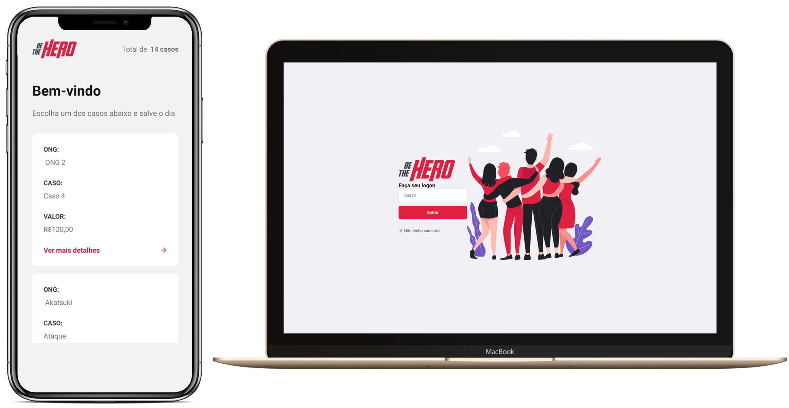

## 👊 Be The Hero

Construido na semana Omnistack 11, desenvolvido por [Rocketseat](https://rocketseat.com.br/).

## 💻 Projeto

Este projeto tem como objetivo ajudar as ONGS a encontrar colaboradores que possa ajudar financeiramente os casos.

## 🦾 Tecnologias

- [Node.js](https://nodejs.org/en/)
- [ReactJS](https://reactjs.org/)
- [React Native](https://reactnative.dev/)
- [Expo](https://expo.io/)
- [KnexJS](http://knexjs.org/)
- [Joi](https://hapi.dev/module/joi/)
- [Celebrate](https://github.com/arb/celebrate#readme)
- [Jest](https://jestjs.io/)

Para ajudar no debug da aplicação foi usado o insomnia, para obter o projeto completo [clique aqui](https://insomnia.rest/run/?label=OmniStack11&uri=https%3A%2F%2Fraw.githubusercontent.com%2FDenisMedeirosSDK%2FOmniStack_11%2Fmaster%2F.github%2FInsomnia_OmniStack_11.json")

## 🤯 Oque eu aprendi

- Banco de dados com SQLite3.
- Validação com celebrate & Joi.
- Enviar mensagem com E-mail & Whatsapp.
- Paginação & Scroll infinito.
- Test com jest.

## 🔧 Como contribuir

- Faça um fork do repositorio
- Cria um Branch com sua feature : `git checkout -b minha-feature`
- Faça commit das suas alterações : `git commit -m 'feat: Minha nova feature`
- Faça push para a sua branch: `git push origin minha-feature `

_Começo 23/03/20 terminou 27/03/20_

## Licença 📝

Esse projeto está so a licença MIT. Veja o arquivo [LICENSE](https://raw.githubusercontent.com/DenisMedeirosSDK/Rocketseat-events/master/LICENSE) para mais detalhes.
